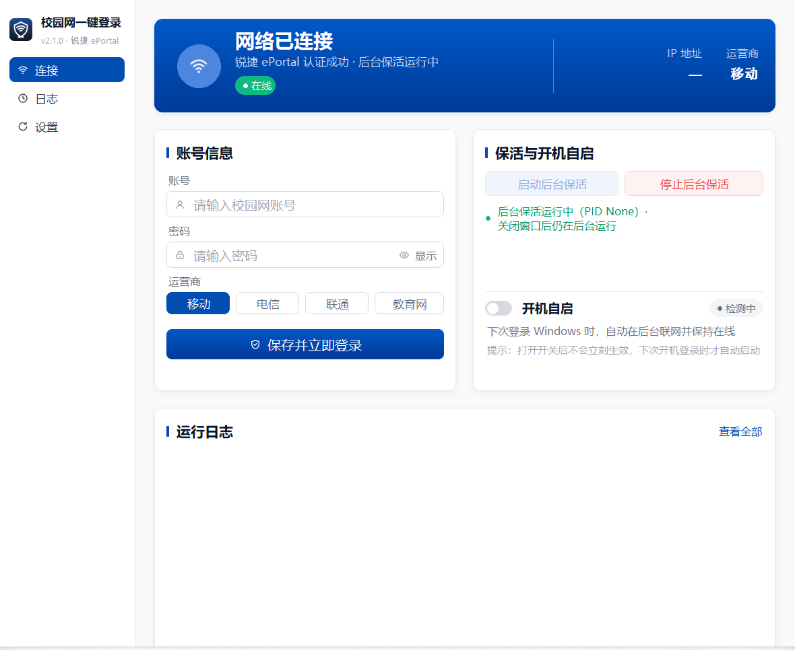
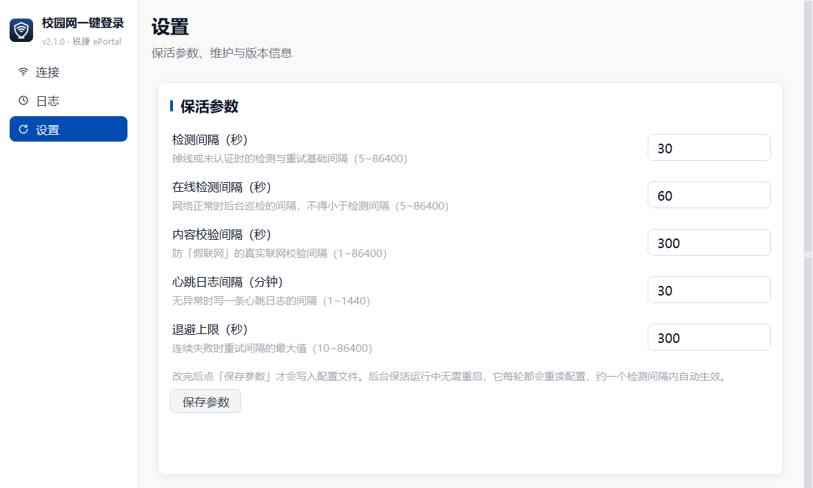

# 校园网一键登录（campus-login）

> 锐捷 ePortal / CAS 校园网一键登录 · Windows 桌面工具

填一次校园网账号密码，之后连上校园网即可自动认证；掉线自动重连，可常驻后台运行，关掉窗口也不影响联网——而且**不会在任务栏右下角留下任何图标**。

当前版本：**v2.1.1** · [更新日志](更新日志.txt) · [Releases](https://github.com/DECKS555/campus-login/releases/latest)



## 主要功能

- **一键认证**：自动识别网络状态，提交锐捷 ePortal / CAS 登录，之后全自动。
- **后台保活**：关掉窗口后仍在后台持续检测与重连；在线稳定后自动放宽检测间隔，并降低进程优先级与 QoS。实测常驻约 3 MB 内存、CPU 长期 0%。
- **安静、不打扰**：后台运行时不占任务栏，也不在通知区域留图标；只有需要提醒你时（账号被顶掉 / 网络已恢复）才短暂弹一条系统通知，读完自动消失。
- **多设备互斥与自动让位**：账号通常只允许一台设备在线。程序**只读地**查询自助服务的在线设备 MAC，确认是其它设备在用网时主动礼让，避免电脑与手机互相踢下线；对方一下线立刻恢复认证，全程不会去踢别人的设备。
- **连续失败自动退避**：登录连续失败时重试间隔逐级拉长、上限可调，校园网维护期间不会疯狂刷请求。
- **换学校可用**：认证网关可手动填写，也可点「自动探测网关」自动发现（探测中按钮转圈，结束后页内给出回执，不弹系统弹窗）。
- **状态可视化**：实时显示连接状态、运营商、出口 IP；可查询「当前谁在用这个账号」（MAC / IP / 设备类型 / 是否本机）；运行日志一屏可见、可翻页看完整记录。
- **参数可调、改完即生效**：各类检测间隔与退避上限都能在设置页调整，点「保存参数」立即落盘；后台保活运行中**无需重启**，约一个检测间隔内自动生效。
- **开机自启**：可配置开机自动拉起后台保活，不弹窗口、不弹 UAC。
- **自动检查更新**：内置 GitHub Releases 版本检查（已指向本仓库）；也支持在 `config.json` 里改成你自己的仓库，不用重新打包。
- **隐私保护**：密码使用 Windows DPAPI 加密存储，`login.log` 中的 sessionId 等临时凭据一律脱敏。

## 下载与安装

1. 打开右侧 **Releases**：<https://github.com/DECKS555/campus-login/releases/latest>
2. 下载最新版 `CampusLogin.exe`。
3. 放到任意普通文件夹（推荐非系统盘、非 `Program Files`，避免权限问题），双击运行即可，**无需安装 Python**。

> 建议同时下载 `使用说明.md`，里面有完整的参数说明与常见问题。

## 快速开始

1. 第一次运行：在「连接」页填写校园网账号、密码，选择运营商，点 **保存并立即登录**。
2. 登录成功后，按需点 **启动后台保活** —— 保活进程在后台常驻，关掉窗口也不影响联网。
3. 去「设置」页调整检测间隔等参数；**改完记得点「保存参数」** 才会写入配置文件。



## 设置页参数

| 参数 | 默认值 | 说明 |
|------|--------|------|
| 检测间隔 | 30 秒 | 掉线 / 未认证时多久检查一次（5~86400） |
| 在线检测间隔 | 60 秒 | 在线稳定后放宽的间隔，且不得小于检测间隔（5~86400） |
| 内容校验间隔 | 300 秒 | 防「假联网」的真实联网校验间隔（1~86400） |
| 心跳日志间隔 | 30 分钟 | 状态无变化时多久写一条心跳日志（1~1440） |
| 退避上限 | 300 秒 | 连续失败时重试间隔的最大值（10~86400） |
| 认证网关 | 10.254.241.66 | 学校认证服务器地址，换学校后必填或点「自动探测」 |
| 页面 ID / NAS IP | — | 由网关下发，登录成功后自动更新，通常无需手动修改 |

> **改完参数一定要点「保存参数」**：参数只存在界面上时不会生效；后台保活运行中**无需重启**，它每轮都会重读配置，约一个检测间隔内自动生效。

## 多设备互斥与自动让位

校园网账号通常只允许一台设备在线。若手机在别处登录把电脑顶掉，程序会：

1. 查询自助服务 `/sam/api/userself/devices` 的在线设备 MAC（只读，不会踢掉对方）。
2. 确认在线设备 MAC 不是本机 → 判定为其它设备在用网，进入礼让状态（首次 15 分钟，反复被顶则翻倍，上限 120 分钟）。
3. 礼让期间停止主动认证，避免与手机互相踢。
4. 礼让期内定期复查；手机一下线，电脑立即恢复认证。

相关参数可在 `config.json` 中调整：`yield_enabled`、`yield_minutes`、`max_yield_minutes`、`device_check_enabled` 等。

## 检查更新

程序内置版本检查，已指向 `DECKS555/campus-login`，发布 Release 后点「设置」→「检查更新」即可。

若你想换成自己的仓库，在 `config.json` 里加一行即可（**优先级高于内置值，不用重新打包**）：

```json
{
  "update_repo": "你的用户名/你的仓库名"
}
```

> 仓库必须是 **Public**，匿名请求才读得到 Release；私有仓库会返回 404。

## 从源码运行 / 自行打包

### 源码运行（调试）

需要 Python 3.13+（3.13.12 / 3.14.7 均已实测），建议安装 Pillow（缺失时图标会降级为整数降采样）。

```powershell
cd src
python app.py
```

源码模式下配置文件路径是 `src/config.json`，运行后才会生成。

> 提示：直接双击运行 `CampusLogin.exe` 会在**它所在的目录**下生成 `config.json` 与 `login.log`。
> 这两类文件已被 `.gitignore` 排除，但请不要在仓库目录里运行程序，也不要手动把它们提交上来。

### 自行打包

两种方式任选其一：

```powershell
# A. 脚本（推荐，会顺手组出干净的对外发布目录）
cd tools
python build_exe.py
```

```bat
:: B. 一键脚本（自动建虚拟环境、装 PyInstaller / Pillow 后打包）
cd src
build.bat
```

都会在项目根目录生成 `CampusLogin.exe`。`tools\build_exe.py` 还会额外复制到干净的对外发布目录。

> 提醒：两种方式的打包参数必须保持一致。历史上一度出现过 `build.bat` 漏掉
> `--add-data app.ico;assets`（`--icon` 只设 exe 文件图标、不会把 ico 放进运行时目录）
> 的情况，导致打出来的 exe 标题栏 / 任务栏图标退回默认样式。改动打包参数时两边都要改。

## 隐私与安全

- **密码**：磁盘上以 `password_enc` 字段保存 Windows DPAPI 密文（仅本机能解密），明文密码绝不写入日志，也不会上传到任何第三方。
- **日志**：`login.log` 中 sessionId、ticket 等临时凭据会被打码；但转发给他人前仍建议先删除 `config.json` 和 `login.log`。
- **不要上传配置**：仓库 `.gitignore` 已排除 `config.json`、`login.log`、`app.pid`、`daemon_state.json`，请勿把它们提交上来。

## 常见问题

- **显示「本地网络不可达」**：正常现象，表示当前没连上校园网（没插网线 / 没连校园 Wi-Fi）。连上后自动恢复。
- **登录页出现图形验证码**：验证码无法自动处理，需要去网页端手动登录一次。
- **换了学校用不了**：每所学校的认证网关地址不同，去「设置」→「高级参数」点「自动探测网关」（需处于连着校园网但还没认证的状态），或手动填写学校提供的 IP / 域名。
- **改了校园网密码**：重新填入新密码并点一次「保存并立即登录」；保活运行中按提示重启即可应用。

更多细节见仓库内的 `使用说明.md`。

## 已知限制

- 面向锐捷 ePortal / CAS 统一认证体系，各校网关响应细节可能有差异。遇到无法自动探测或登录失败，欢迎带上 `login.log` 到 [Issues](https://github.com/DECKS555/campus-login/issues) 反馈。

## 免责声明

本项目仅供**合法校园网用户个人自用**，请遵守所在学校的网络管理规定。作者不对因使用本工具产生的任何账号 / 网络问题负责。

## License

[MIT](LICENSE) © 2026 DECKS555
